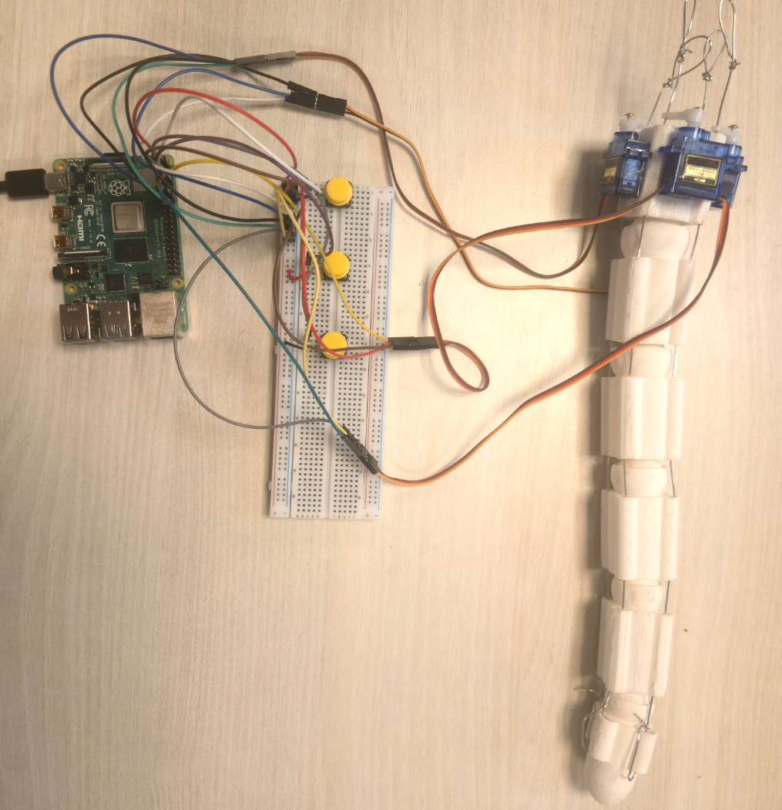
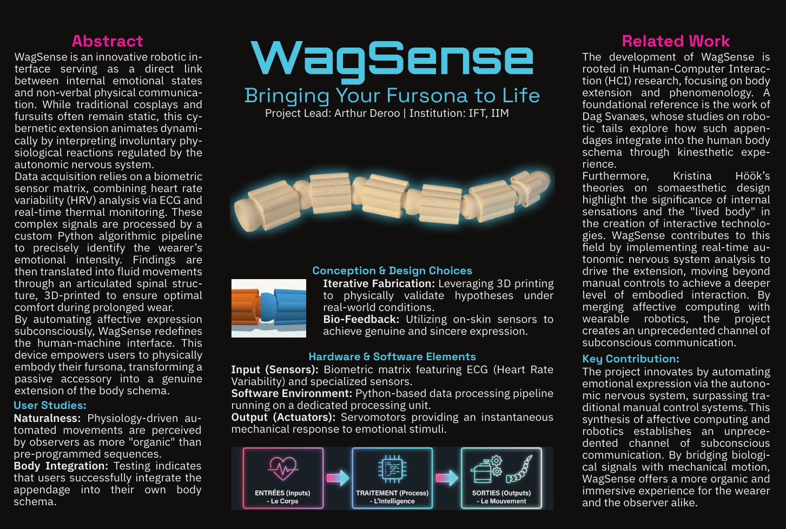

# WagSense: Proto-Cybernetic Emotional Interface

**Project Lead: Arthur Deroo | Institution: IFT, IIM**

---

## 📝 Overview
WagSense is a prototype of an expressive robotic tail designed to investigate human–computer interaction (HCI) by mimicking animal movements. Using advanced kinematics, it imitates animal behaviour in order to convey emotional states such as joy, sadness, and neutrality.

The project's goal is to translate digital emotional inputs into organic physical movements. Rather than being a rigid stick, the tail acts as a flexible spine, changing its rigidity and speed based on context.

### Key features:
There are three distinct emotional states:
- Happy: High speed and amplitude; rigid movement.
- Sad: Low speed and amplitude with fluid movement.
- Neutral: Medium speed with fluid undulation.  

Hybrid Kinematics Engine: This dynamically modifies the phase offset between motors, switching from a flexible spine to a rigid structure in real time. 

Smooth transitions: Uses linear interpolation (LERP) to prevent jerky movements when switching between emotions.



## 🛠️ Hardware & Wiring

### Bill of Materials (BOM)Controller:
- Raspberry Pi 4 Model B (2018).
- Actuators: 4x SG90 Micro Servos (9G).
- Input: 3x Push Buttons (Happy, Neutral, Sad).
- Power: 5V/3A Wall Adapter (USB-C) for the Pi. Crucial: Do not power via PC USB port.
- Circuit: Large Breadboard + Jumper wires.

### Wiring Diagram (GPIO Mapping)
The project uses the gpiozero library. Ensure common ground between servos and the Pi.

| Component | Physical Pin | GPIO (BCM) | Function |
| :--- | :--- | :--- | :--- |
| **Servo 1 (Base)** | Pin 11 | GPIO 17 | Root movement |
| **Servo 2** | Pin 13 | GPIO 27 | Mid-low section |
| **Servo 3** | Pin 15 | GPIO 22 | Mid-high section |
| **Servo 4 (Tip)** | Pin 12 | GPIO 18 | Tip movement |
| **Button Happy** | Pin 3 | GPIO 2 | Trigger Joy |
| **Button Neutral** | Pin 5 | GPIO 3 | Trigger Neutral |
| **Button Sad** | Pin 7 | GPIO 4 | Trigger Sadness |

## 🚀 Installation & Usage

1. Prerequisites  
Ensure your Raspberry Pi is running Raspberry Pi OS (Bookworm or later) and Python 3.

```bash
    sudo apt update
    sudo apt install python3-gpiozero python3-pigpio
```

2. Installation  
Clone the repository

3. Running the Project  
It is recommended to run the script with administrative privileges to access GPIOs without restriction.

```bash
    sudo python3 wagsense.py
```

4. Operation Guide  
- Calibration: Upon launch, the tail performs a "Dance of Initialization" (Left-Right-Center) to align servos. Wait 3 seconds.

- Interaction:
  - Press Button 1 (Pin 3): HAPPY Mode. The tail stiffens (offset ≈ 0) and vibrates rapidly.
  - Press Button 2 (Pin 5): NEUTRA Mode. The tail relaxes (offset = 0.25) and sways gently.
  - Press Button 3 (Pin 7): SAD Mode. The tail slows down significantly and droops.


### Version History

| Hardware Version | Software Version | Comments |
| :---: | :---: | :--- |
| **V0.1** | v0.1 | **Initial Prototype (1 Servo):** "Hello World" test. Fixed power rail discontinuity on the breadboard. |
| **V0.1** | v0.5 | **Multi-Axis Setup (4 Servos):** Implementation of sequential initialization to fix brown-out (reboot) issues caused by current spikes. |
| **V1.0** | v1.0 | **Snake Algorithm:** Replaced rigid movement with a sine wave function `sin(t - offset)` for organic fluidity. |
| **V1.0** | v2.0 | **Hybrid Kinematics (Current):** Introduced `wave_factor` to dynamically switch between "Rigid Stick" (Happy) and "Fluid Snake" (Neutral/Sad). |

Mechanical Integration: Transition from VR prototyping (v0.1) to a 3D-printed modular vertebral structure to guide movement and secure wiring.

## 📂 File Structure
- wagsense.py: Main executable containing the kinematics engine and state machine.
- debug.log: Generated automatically to trace GPIO errors or logic states.
- README.md: This documentation.
- LICENSE : license file.

## 🔮 Future Improvements
- Sensors: Replace buttons with body sensors.
- Add more powerful servomotors.
- Feedback: Add haptic feedback when the tail hits an obstacle.

## 🪧 Poster



## 🎬 Video

A demo video is available in the assets folder: "Wagsense_Demo.mp4”.  
Please use MPV to play the video.

## ⚖️ License & Copyright

**Copyright (c) 2026 Arthur Deroo. All rights reserved.**

Ce programme est la propriété exclusive de son auteur. Toute reproduction, modification ou distribution du code source, sous quelque forme que ce soit, est strictement interdite sans l'autorisation écrite préalable de l'auteur.

*This software is proprietary. No part of this project may be reused, modified, or redistributed for any purpose without explicit permission.*